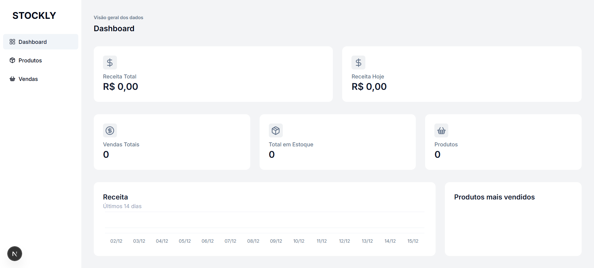

# Stockly

Stockly é uma aplicação Next.js para gerenciamento de estoque e vendas — painel administrativo simples para cadastrar produtos, registrar vendas e acompanhar métricas (receita, produtos mais vendidos, estoque, etc.).

## Principais Tecnologias

- Next.js (App Router)
- TypeScript
- Tailwind CSS
- Prisma (PostgreSQL / SQLite)
- Sonner (notificações) e outros componentes UI customizados

## Principais Funcionalidades

- Cadastro e edição de produtos
- Registro e gerenciamento de vendas
- Dashboard com métricas: receita do dia, últimos 14 dias, produtos mais vendidos
- Controle de estoque e total de produtos
- Operações seguras via actions com validação de schema

## Como Executar (Desenvolvimento)

Pré-requisitos: Node.js (>= 18 recomendado), pnpm/npm/yarn, banco de dados (Postgres ou SQLite).

1. Instale dependências:

```bash
npm install
# ou
pnpm install
```

2. Crie um arquivo de ambiente:

```bash
cp .env.example .env
# Edite `.env` com suas credenciais (DATABASE_URL, NEXTAUTH_URL, etc.)
```

3. Configure o banco de dados (se estiver usando Prisma + SQLite/Postgres):

```bash
npx prisma migrate dev --name init
```

4. Rode em modo de desenvolvimento:

```bash
npm run dev
```

Abra http://localhost:3000

## Build e Produção

```bash
npm run build
npm run start
```

## Estrutura Principal

- `app/` — rotas e componentes da aplicação (páginas, \_components, actions)
- `prisma/` — schema do Prisma e migrations
- `public/` — assets públicos (coloque screenshots em `public/screenshots`)
- `components/` e `app/_components/` — componentes reutilizáveis e UI
- `app/_data-access/` — queries e funções para dados (dashboard, product, sale)

## Screenshots (adicione manualmente)



## Observações

- Mantenha o arquivo ` .env.example` no repositório para orientar variáveis de ambiente.
- Se for usar Postgres em produção, preencha `DATABASE_URL` e rode migrations adequadas.

## Contribuição

Pull requests são bem-vindos. Para alterações significativas, abra uma issue primeiro para discutir o que pretende fazer.

## 👽Contato

gabriel_nobresantos@hotmail.com
